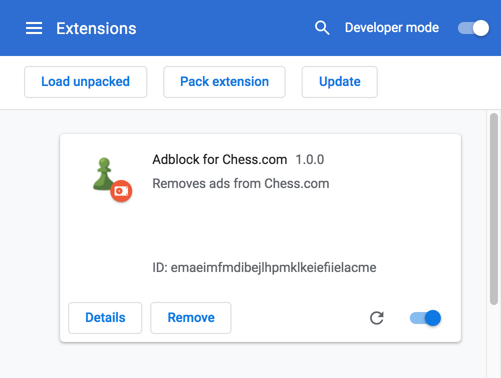

Ad Block for Chess.com
======================

This is a simple Google Chrome extension that blocks ads on [Chess.com](https://www.chess.com/). 

**Features:**
- Hides ads via CSS

## Installation

**Steps:**
1. Download the [latest release](https://github.com/upscalesoftware/chrome-chesscom-adblock/releases)
2. Extract the archive to a directory 
2. Open [chrome://extensions/](chrome://extensions/)
3. Enable the Developer mode
4. Load unpacked extension from the directory
  

## Contributing

Pull Requests with fixes and improvements are welcome!

## License

Copyright © Upscale Software. All rights reserved.

Licensed under the [Apache License, Version 2.0](https://github.com/upscalesoftware/chrome-chesscom-adblock/blob/master/LICENSE).